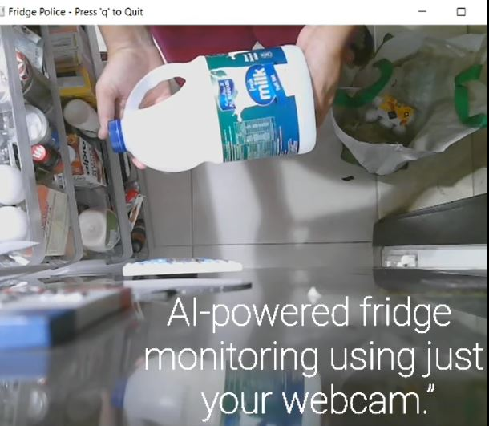
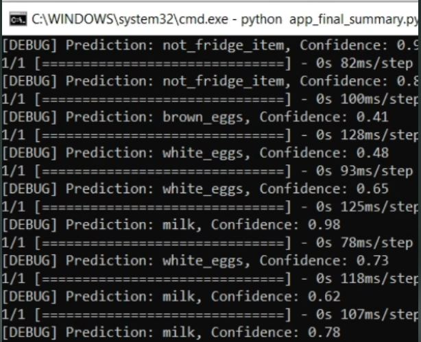

# Fridge Police
  

Fridge Police is a desktop app that helps monitor perishable fridge items using a webcam and a custom-trained machine learning model. Originally inspired by everyday challenges faced at home, it aims to reduce food waste by detecting items and alerting users about upcoming expiry.

Youtube: https://youtu.be/M8hmh55aA2k?si=z2mEyMTpEuoQlV2t
Drive: https://drive.google.com/drive/folders/15EM6vaSg5Mf1on8yF8pN7M5DjdKrIDeJ

## Download the Application

You can download the latest Windows executable here:  
[Download fridge_gui_combined.exe (Google Drive)](https://drive.google.com/file/d/1BZuPmUK27jrmjiiT5SXu6FE_sv6VoIJ-/view?usp=sharing)

## 🔧 How It Works

- Uses a **Logitech webcam** to capture real-time images
- A **Teachable Machine** image classifier predicts the item (e.g., Carrot, Cucumber, Milk)
- **Shelf Life & Expiry Calculation** - For each recognized item, Fridge Police automatically assigns an estimated expiry date based on a predefined shelf life (how long the item typically stays fresh in the fridge). This allows the app to alert users as items approach their expiry

This feature is currently available for carrots, lettuce, milk, and eggs. Expanding the shelf life database for more items is planned for future releases.

## How to Run Fridge Police (Windows)

**1. Find the App File**

- In the folder you downloaded or received, look for a file named:
  ```
  fridge_gui_combined.exe
  ```
  (It may just show as `fridge_gui_combined` with a small application icon.)

**2. Double-Click to Open**

- Simply **double-click** the `fridge_gui_combined.exe` file.
- The app will open in a new window.
- If you get a security warning, click “More info” then “Run anyway” (this is normal for new apps).

**3. Using the App**

- When the app opens, you'll see the Fridge Police logo and three buttons:
  - **SHOW GROCERIES**: Use your webcam to scan and add new items to your fridge list.
  - **SHOW FRIDGE**: See a list of all items currently in your fridge.
  - **SHOW EXPIRES**: Check which items are close to expiring. Slide-down toast alerts for items expiring in less than 2 days. 

- To scan groceries, make sure your webcam is connected. The app will guide you!

**4. To Close the App**

- Click the “X” at the top right corner of the window, or use the on-screen buttons to exit scanner windows.

---

## Troubleshooting

- **If double-clicking does nothing:**  
  Right-click the file and choose **"Run as administrator."**

- **If you see a security warning:**  
  Click “More info” and then “Run anyway.”

- **If you get a webcam error:**  
  Make sure your camera is plugged in and not being used by another app.

- **If you see missing files or errors:**  
  Make sure all files provided (like `fridge_gui_combined.exe`, and image/model files) are in the same folder.

---

## No Installation Needed!

- You do **not** need to install anything extra. Just double-click the app file and go!

---


## 🛠️ Tech Stack

- **Teachable Machine** (No-code ML training)
- **Python + TensorFlow** (Model integration)
- **OpenCV** (Webcam input)
- **Tkinter** (GUI)
- **Pillow, NumPy** (Image processing)

## ⚠️ Model Scope & Limitations

*This release is an early proof-of-concept designed for the Decoding Data Science AI Challenge.*

- The current machine learning model has been trained to recognize a limited set of fridge items, primarily:
  - Plastic bags of carrots 
  - Lettuce (wrapped in cling film)
  - Milk bottles (Al Rawabi brand)
  - White egg carton

- **Best Results:** The system is optimized for these specific products and packaging. For best accuracy, please present these items (or similar) directly in front of the webcam.

- **General Use:** While the underlying approach is extendable, results for other brands, packaging, or food types may vary due to a smaller training dataset.

- **Future Work:** 
  - Expanding the training dataset to include more brands, packaging styles, and food categories is a key next goal. This will enhance both the model’s accuracy and its suitability for broader real-world use.
  - Barcode/QR Code Scanning -  letting users scan barcodes or QR codes for more reliable product identification.
  - Use computer vision to estimate freshness or spoilage (e.g., color/texture analysis for fruits/veggies).
  - Shopping list generation

---
## 🔗 Challenge

Built for the [Decoding Data Science AI Challenge](https://decodingdatascience.com/ai-challenge)


Enjoy using Fridge Police!


